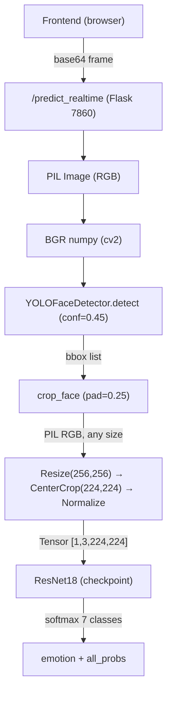

# RAF-DB Dataset Download & Experiment Log Setup

## Context summary (for the agent)

This project is a **real-time facial emotion recognition** stack. Key facts:

- Repo path: `/home/wumenglin/Emotion_detection/`
- Model: **ResNet18**, 7 classes (`surprised, fear, disgust, happy, sad, anger, neutral`)
- Training: [`backend/model_njb/Transfer Learning.py`](backend/model_njb/Transfer%20Learning.py) on **RAF-DB**
- Inference weights: see current project docs (e.g. `best_rafdb_model_1.pth` under `backend/model_njb/` per CLAUDE.md)
- Face detection: **YOLOv8-face** (`backend/yolov8n-face.pt`) → crop → ResNet18

### Identified issue

In [`backend/api/api_server.py`](backend/api/api_server.py) (`predict_realtime_emotion`) and [`backend/api/yolo_face_detector.py`](backend/api/yolo_face_detector.py) (`crop_face`), the pipeline is roughly:

```
YOLO bbox → crop_face(pad=0.25) → [no size filter] → Resize(256,256) → CenterCrop(224,224) → ResNet18
```

If the face is small in the frame (e.g. subject far away), the crop may be ~40×40 px, then **upsampled** to 256×256 → blur → softmax near uniform (~1/7 per class).

**Future fix**: retrain with **blur augmentation** on RAF-DB so the model tolerates blurry low-res crops.

### Architecture sketch



---

## Tasks

### Task 1 — Download RAF-DB

Official RAF-DB may require registration. A reproducible path is Kaggle.

- Official (email request): http://www.whdeng.cn/RAF/model1.html  
- Kaggle: search `raf-db`

Kaggle CLI (example):

```bash
pip install kaggle
# Place ~/.kaggle/kaggle.json
kaggle datasets download -d shuvoalok/raf-db-dataset
unzip raf-db-dataset.zip -d /home/wumenglin/Emotion_detection/data/RAF-DB
```

Expected layout:

```
data/RAF-DB/
├── train/
│   ├── anger/
│   ├── disgust/
│   ├── fear/
│   ├── happy/
│   ├── neutral/
│   ├── sad/
│   └── surprised/
└── test/
    └── (same 7 subdirs)
```

Update `data_dir` in `Transfer Learning.py` (line ~15) to the local path.

### Task 2 — Create experiment log

Create `EXPERIMENT_LOG.md` at repo root.

It should capture:

- Baseline: ResNet18 + RAF-DB, 7 classes, which checkpoint is default
- Known issue: small-face blur in realtime pipeline
- Planned improvement #1: blur augmentation in retraining
